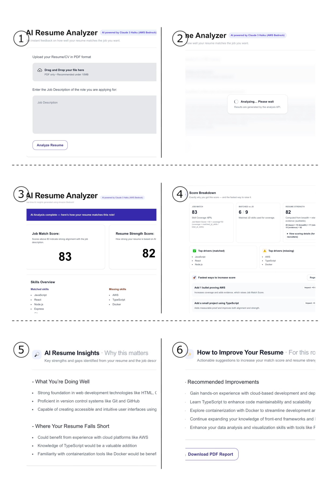
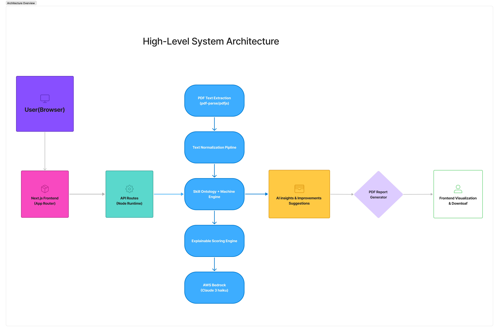

# AI Resume Analyzer



- An AI-powered resume analysis platform that evaluates how well a resume matches a specific job description, explains the scoring logic, and provided actionable & AI-generated improvements suggestions.Built with Next.js, AWS bedrock(Claude 3 Haiku), and a transparent scoring system with explainable AI outputs(just open for company).

# Architecture Overview

**Architecture Overview**

High-level system architecture:

User (Browser)
↓
Next.js Frontend (App Router)
↓
API Routes (Node Runtime)
├─ PDF Text Extraction (pdf-parse / pdfjs)
├─ Text Normalization Pipeline
├─ Skill Ontology + Matching Engine
├─ Explainable Scoring Engine
└─ AWS Bedrock (Claude 3 Haiku)
↓
AI Insights & Improvement Suggestions
↓
PDF Report Generator (PDFKit)
↓
Frontend Visualization & Download



**Project Structure**

app/
api/
analyze/ # Resume analysis pipeline (extract → normalize → match → score → AI)
report/pdf/ # PDF report export
components/ # UI components
pages/ # Product pages (generate-score, success-score, fail-score)
assets/fonts/ # Custom fonts for PDF rendering

# Goals

- 1.Help candidates understand why their resume matches or does not match a role
- 2.Provide recruiters with transparent and auditable scoring
- 3.Avoid black-box AI by combining:
  - A.Rule-based scoring
  - B. Heuristic evidence scoring
  - C. LLM-generated insights(Bedrock)
- Demonstrate a real-world AI product architecture rather than a demo-only project

# Live Demo

# Features

- Resume upload & Text extraction(PDF)
- Skill extraction with alias normalization(e.g. React/ React.js / ReactJS)
- LLM-based resume analysis(AWS bedrock - Claude 3 Haiku)
- AI Showing scores (Job Match score + Resume Strength score)
- AI-generated insights & resume improvements suggestions(AWS bedrock)
- Product-style PDF report export
- Transparent scoring breakdown (auditable for recruiters)

# Tech Stack & Design Rationale

## Tech Stack

- Frontend: Next.js, Tailwind CSS
- Backend: Next.js API routes(Node runtime)
- AI: AWS Bedrock (Claude 3 Haiku)
- Cloud: AWS bedrock Runtime SDK
- Data: JSON-based scoring + explainable breakdown
- Tools: AWS SDK, Pdfkit(PDF report generation),customer Inter fonts for PDF rendering

## Design Rationale

- Next.js (App router): enable full-stack architecture with frontend + API routes in a single codebase, suitable for repaid prototyping and production MVP.
- AWS Bedrock (Claude 3 Haiku): Chosen for low latency and cost-efficient LLM inference suitable for high-frequency resume analysis use cases.
- Rule-based + Heuristic Scoring: Ensure deterministic, auditable outputs for enterprise trust and explainable AI requirements.
- PDFkit: Enable generation of shareable product-style reports.

---

# Project Phases

## Phase 1- Resume Upload & Text Extraction

- Goal: Allow users to upload a resume(PDF) and extract raw text for AI analyzing.
- what's implemented:
  - 1.File upload UI
  - 2.Server-side PDF text extraction
  - 3.Basic validation + JDinput(empty file, unsupported format)
  - 4.Store extracted text in session for later analysis

---

## Phase 2 - Text Normalization Pipeline

- Goal: Clean and normalize resume & JD text for reliable matching.
- Techniques:
  - 1.Normalize line breaks
  - 2.Collapse multiple spaces
  - 3.Trim extra whitespaces

- why important:
  - Ensure consistent matching and reduced noise for downstream AI & Scoring logic.

---

## Phase 3 - Skill Bank(Canonical Skills)

- Goal: Create a standardized skill vocabulary used across scoring and AI prompts.

---

## Phase 4 - Skill Extraction & Matching Engine

- Goal: Detect skills in resume & job description text and compute overlap
- Features:
  - Regex-safe matching(C++. C#, .Net, CI/CD)
  - Deduplication
  - outputs:
    - `matchedSkills`
    - `missingSkills`
    - `coverage = matchedJD / totalJD`
- Why this matters:
  - This layer forms the quantitative foundation for scoring and explainability.

---

## Phase 5- Explainable Scoring Engine

### Job Match Score(0 - 100)

```
coverage = matched_jd_skills / total_jd_skills
jobMatchScore = round(50+ coverage * 50)
```

### Resume Strength Score(0-100)

```
Resume Strength = base + breadth + relevance + evidence(cap at 100)
base = 40
breadth(0-40) = min(unique_resume_skills,20) *2
relevance(0-20) = min(matched_jd_skills,10) *2
evidence(0-20) = heuristics from resume bullets
```

- Evidence Heuristics:
  - Action verbs (built, implemented, optimized)
  - Metrics(%, ms,users, performance)
  - Project signals(API, full-stack, AWS, Next.js)

### Design Rationale:

- The Job Match Score is intentionally begin at _50 as a baseline_ to avoid overly discouraging low-match candidates and to reflect partial skill transferability.
- Coverage is weighted heavily to emphasize alignment with _job requirements_ rather than raw skill quantity.
- Resume Strength Score Combines:
  - _Breadth_: general skill diversity
  - _Relevance_: alignment with JD skills
  - _Evidence_: quality of resume bullets(metrics, action verbs, project signals)

---

## Phase 6 - Product-Style PDF Report Export

- Goal: Transform analysis into a shareable product artifact.
- Implemented:
  - `/api/report/pdf` endpoint
  - pdfkit rendering
  - Customer Inter fonts
  - Structured layout:
    - Header (AI model + region metadata)
    - Score cards
    - Skills overview
    - AI insights
    - Improvements recommendations
    - JD snippet
- Value:
  - Turn analysis into something users can submit to recruiters or mentors.

---

## Phase 7 - Skill Ontology & Synonym Normalization

- Goal: Improve recall and accuracy of skill extraction using a Skill Ontology.
- what was added:
  - `SKILL_ALIAS` map:

```
"AWS": [
    "amazon web services",
    "amazon aws",
    "aws cloud",
    "aws services",
    "aws platform",
  ]
```

- Ontology Behavior:
  - Any alias match to canonical skill
  - Canonical skills are used in:
    - _Matching_
    - _Scoring_
    - _AI prompts_
    - _Score breakdown_

- Why this matters:
  - This is a real NLP engineering step, moving from string matching to structured knowledge representation.

### Why skill ontology instead of naive keyword matching:

- Reduces false negatives caused by naming variations(e.g.,React vs React.js vs ReactJS )
- Improve recall for skill extraction
- Create a normalized skill layer that supports:
  - Scoring consistency
  - Long-term skill graph expansion
  - Transferable skill reasoning (Phase 9)

---

## Phase 8 - Score Breakdown (Explainable AI layer)

- Goal: Explain why a score is given and how to improve it faster.
- User-Facing View:
  - Job Match Score
  - Resume Strength Score
  - Skill Coverage %
  - Top Matched Skills
  - Top Missing Skills
  - Improvements Suggestions
- Recruiter/ Enterprise View:
  - Inputs used:
    - matched skill count
    - JD skill count
    - resume skill breadth
  - Formula breakdown
    -Component scores:
    - Breadth
    - Relevance
    - Evidence
  - Heuristic explanation
- Impact: this converts the system from a "resume score" into an explainable decision-support tool.

### Example Explainable Outputs:

- Job Match Score: 75
- Resume Strength Score: 84
- Coverage: 0.5

- Matched Skills(Top 3 shown):
  - React
  - Next.js
  - Aws
- Missing Skills(Top 3 shown):
  - Docker
  - CI/CD

#### Explanation:

- _JobMatchScore_ = 50+ coverage \* 50 = 50 + 0.5 \* 50= 50 + 28 = 75
- _ResumeStrengthScore_ = base(30) + breadth + relevance + evidence = 30 + 24 + 12 + 18 = 84
  - Breadth: + 24 (12 unique resume skills × 2)
    - Overall Skill diversity in resume
  - Relevance: + 12 (6 matched JD skills × 2)
    - How many resume skills directly align with JD requirements
  - Evidence: + 18
    - The presence of quantified impact, action verbs, and project signals

---

## Phase 9 - Access-Controlled AI Architecture

- Goal：To protect AWS Bedrock inference costs and prevent public abuse, the live AI analysis feature is protected by a **server-side access control mechanism**.Only users with a valid **demo access code** can trigger the AI-power resume analysis.

### Architecture Diagram


User Browser
│
│ Click "Analyze Resume"
▼
Access Code Modal
│
│ POST /api/access/verify
▼
Access Verification API
│
│ Validate Access Code
▼
Server Creates Secure Cookie
demo_access = granted
│
│
▼
User Runs Analysis
POST /api/analyze
│
▼
Protected API Layer
(checks cookie)
│
├── Invalid → 401 Unauthorized
│
▼
Resume Processing Engine
(PDF parsing + skill extraction)
│
▼
AI Analysis Service
AWS Bedrock
Claude 3 Haiku
│
▼
AI-Enhanced Resume Report

### System Design Explanation

- The system introduces a **demo access gate** before executing the AI pipeline.

**Step 1- Access Verification**

- When the user clicks **Analyze Resume** button, the system prompts for an access code. The code is verified through:

`POST /api/access/verify`

- if the code is valid, the server creates a secure session cookie:
  `demo_access = granted`

- The cookie is configured with:
  - httpOnly
  - sameSite = lax
  - secure(in production)
  - expiration time

**Step 2- Protected AI Endpoint**

- The main analysis endpoint is protected:
  `POST /api/analyze`
- Before executing the resume analysis pipeline, the server verifies the cookie:

```
const accessCookie = req.cookies.get("demo-access)?.value;
if (accessCookie !== "granted"){
  return NextResponse.json(
    {
      ok: false, message: "unauthorized"
    },
    {
      status: 401
    }
  )
}
```

- if the cookie is missing, the request is rejected and no AI calls is made.

**\*Why This Design Matters**

- This architecture demonstrates several production-level design considerations:
  **Cost Control**
- AI inference calls are restricted to authorized users only.

**Security**

- Access Verification is performed server-side using secure cookies.

**Abuse Prevention**

- Unauthorized API calls are blocked before reaching the AI model.

**Real-world Product Thinking**

- The system mimics how real SaaS platforms protect paid AI features.

---

## Phase 10 - AI Depth Enhancements (Planned / In progress)

- Goal: Move from a demo-level Ai resume analyzer to a **production-grade, enterprise-ready AI platform** with user identity, personalization, explainable AI, and monetization capabilities.

### 1. User System & Productization

**Objective:**

- Introduce a real product user model to support both individual job seekers and enterprise recruiters.

**Planned Features:**

- user authentication & registration (Individual & Enterprise accounts)
- Role-based access control(RBAC)
- User profile management and history tracking
- Usage quota & credit system (limit AI calls for free users)
- Subscription tires:
  - Free (Limited monthly analyses)
  - Pro (advanced features for individuals)
  - Enterprise (unlimited usage, batch processing, recruiter tools)

**Product Rationale:**

- Controls AI inference cost
- Enables personalization of AI insights
- Establishes a foundation for monetization and real-world deployment

### 2. Explainable & Evidence- Grounded AI

**Objective:**

- Make AI outputs transparent, auditable, and trustworthy for both users and recruiters.

**Planned Enhancements:**

- Evidence-Grounded insights:
  - Each AI recommendation is linked to specific resume snippets and job description requirements.
- Traceable reasoning:
  - Show which skills, phrases, or experiences triggered each insights
- AI confidence scoring:
  - Attach a confidence score to each AI-generated insights to mitigate hallucinations
- Recruiter explain mode:
  - Expose scoring logic and reasoning for enterprise users.

**Value:**

- Improves trust in AI recommendations
- Supports explainable AI and auditability
- Reduces black-box decision making

### 3. Resume Improvement & AI Writing Assistant

**Objective:**

- Transform the system from a passive analyzer into an **active resume optimization tool**

**Planned Enhancements:**

- AI-powered resume bullet rewriting:
  - Convert raw resume bullets into structured, impact-driven statements(Action + Tool + Result)
- Quantification suggestions:
  - Encourage metrics such as performance gains, user impact or efficiency improvements
- Skill gap remediation:
  - AI-generated suggestions on how to rewrite existing experience to better match job requirements

**Value:**

- Provides immediate, actionable value to user
- Help bridge the gap between analysis ans real resume improvements
- Improve user outcomes and engagement

### 4. Skill Ontology 2.0 & Skill Graph Reasoning

**Objective:**

- Enhance the existing skill ontology into a **structured skill graph** that enable high-level reasoning

**Planned Enhancements:**

- Hierarchical skill relationships:
  - example: AWS - (S3, Lambda, IAM, CloudFront)
- Transferable skill reasoning:
  - Identify adjacent skills (like Node.js - Express.Js - API Design)
- Dynamic Skill expansion:
  - Continuously evolve skill ontology based on new job market trends

**Value:**

- Improve matching accuracy
- Enables more intelligent AI reasoning
- Makes the system more future-proof

### 5. Role Benchmarking & Industry Baselines

**Objective:**

- Provide industry-aware benchmarking rather than isolated JD comparison.

**Planned Enhancements:**

- Role types:
  - example: Frontend Engineer, Backend Engineer, Full-stack Engineer, Data Engineer, AI Developer, etc.
- Industry skill baseline:
  - Compare user profile against role benchmarks, not just a single JD
- Gap analysis VS market standard:
  - Highlight missing skills relative to industry expectations

**Value:**

- Positioning the product as a **career planning and skill development platform**
- Add long-term user value beyond single job applications

### 6. Enterprise AI features

**Objective:**

- Provide recruiter-grade AI decision support tools.

**Planned Enhancements:**

- Batch resume screening:
  - Analyze and rank multiple candidates for the same role.
- Candidate comparison dashboard:
  - Side-by-side comparison of match scores, strengths, and gaps
- Recruiter scoring view:
  - Detailed breakdown of how each candidate score was computed
- Hiring insights:
  - Identify skill distribution trends across candidate pools

**Value:**

- Enable enterprise adoption
- Support real-world hiring workflows
- Create clear differentiation from consumer-only resume tool

### 7. AI Governance, Safety and Cost control

**Objective:**

- Ensure the AI system is reliable, cost-aware, and production-ready

**Planned Enhancements:**

- Rate limiting & Usage monitoring for AI API calls
- Model usage analytics and cost tracking
- Logging & observability for AI outputs
- Safeguard against prompt injection and misuse

**Value:**

- Enable scalable deployment
- Reduce operational risk
- Aligns with best practices for production AI systems

**Phase 9 Outcome**

- By completing phase 9, the project evolves from a portfolio demo into a **product-oriented, explainable AI system** that capable of supporting both individual users and enterprise recruitment workflows, with a clear path toward real-world commercialization ans AI system maturity.

---

# AI limitations and Risk Mitigation

- LLM outputs may contain hallucinations
- All AI insights are treated as assistive recommendations, not hiring decisions
- Rule-based scoring and heuristic signals remain the primary source of truth for final match scores.
- Future iterations may include confidence scoring and human-in-the-loop review for critical decisions.

# Privacy & Data Handling

- Resume content is processed in-memory and not stored permanently
- No user resumes are used for model training or fine-tuning.
- The system is designed with data minimization principles inspired by GDPR-style(General Data Protection Regulation) privacy guidelines.
- Future production deployment would include user consent management and data retention policies.

# Who is project for:

- Job Seekers who want transparent feedback on resume-JD alignment
- Recruiter who require auditable and explainable screening tools
- Engineering teams building AI-powered decision-support systems
- Product teams exploring explainable AI in hiring workflows
